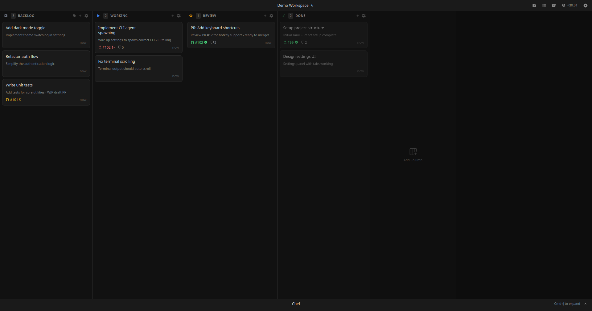
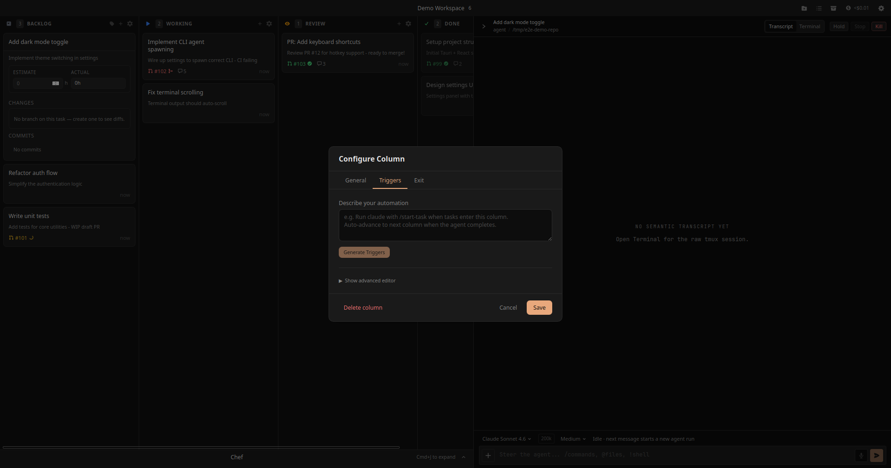
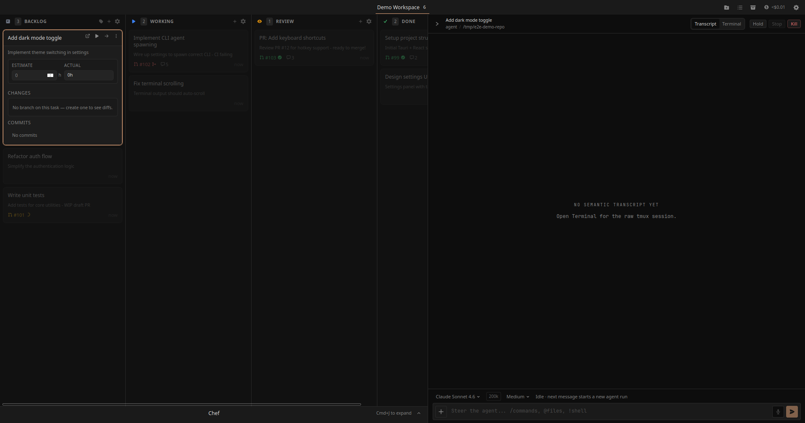
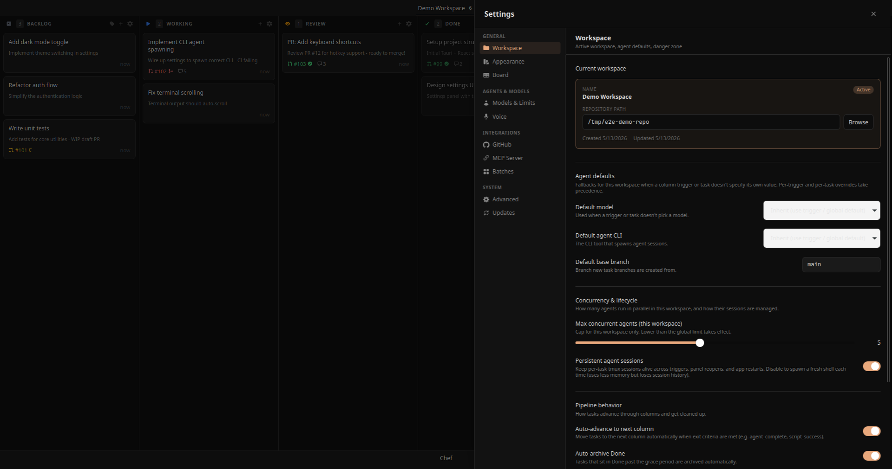

# KaitenCode

Tauri desktop app for orchestrating AI coding agents — an automated kanban board where columns are pipeline stages with trigger-driven automation.



### Column automation, in natural language

Each column can declare `on_entry` / `on_exit` triggers. Describe the automation you want and the app generates the trigger config — or drop into the advanced editor for spawn_cli / move_column / run_script / create_pr actions.



### Per-task agent panel with embedded tmux terminal

Click a task card to open its agent panel: semantic transcript on the right, live tmux-backed terminal one tab over, lifecycle controls (Hold / Stop / Kill), model + thinking-effort selectors, and a chat box for steering the agent mid-run.



### Workspace + agent settings

Per-workspace and global settings: concurrency limits, default CLI, default model, base branch, pipeline behavior (auto-advance, archive on done), agent session persistence across restarts.



> Regenerate these screenshots: `pnpm test:webdriver -- --spec ./tests/webdriver/screenshots.spec.mjs` (see [Native WebDriver E2E](#native-webdriver-e2e) below for one-time setup).

## v2.0 Features

- **PR auto-create trigger** — columns can fire a `create_pr` action on exit to open a GitHub pull request when a task completes a stage (requires `gh` CLI installed and authenticated)
- **Per-task git worktree isolation** — each task can run in its own git worktree (`<repo>/.worktrees/kaitencode-<taskId>/`), reducing local branch and worktree collisions between agents
- **DAG dependency UI with hover-reveal lines** — tasks define dependency relationships with cycle detection; bezier lines between cards appear on hover to visualize the dependency graph

## v2.1 — Embedded Terminal

- **Per-task embedded terminal** — each task gets a full xterm.js terminal (lazy PTY, bare shell in working dir). Click a task card to open its terminal.
- **xterm.js integration** — WebGL renderer, 10k line scrollback, fit-addon for responsive resizing, theme-reactive (dark/light), Unicode 11 support
- **Persistent tmux sessions** — running task terminals attach to per-task tmux sessions and keep scrollback across panel reopens. Completed tasks open in attach-only mode so viewing history does not spawn a fresh shell.
- **Unified chat session layer** — `UnifiedChatSession` manages lifecycle (idle/running/suspended), resume ID tracking, transport switching (pipe ↔ PTY)
- **Legacy process layer removed** — deleted `pty_manager.rs`, `agent_runner.rs`. All PTY/agent management through unified `SessionRegistry`

## Development

### Runtime prerequisites

Packaged macOS and Linux builds expect these tools to be available on `PATH` for the corresponding features:

| Tool | Required for | Install |
|------|--------------|---------|
| `tmux` | Agent sessions, embedded terminals, pipeline triggers | macOS: `brew install tmux`; Linux: distro package manager |
| `git` | Workspace validation, branches, diffs, task worktrees | macOS command line tools or distro package manager |
| `gh` | PR creation and GitHub status sync | `brew install gh` or GitHub CLI packages |
| `claude` / `codex` | Running the selected agent CLI | Install and authenticate the CLI you plan to use |

Desktop-launched apps on macOS/Linux may not inherit your shell dotfiles. First-run onboarding shows a system check for required tools. If a CLI is not detected, set its path in Settings > Agents & Models.

The local HTTP API powers the MCP server and any external automation that drives the board, so it is **enabled by default**. It binds to `127.0.0.1` only and authenticates every request with a per-run bearer token, written along with the chosen port to a user-readable-only (`0600`) discovery file at `~/.kaitencode/api.port`. To opt out (no MCP/automation control), start KaitenCode with `KAITENCODE_LOCAL_API=0` (or `false`/`no`/`off`).

### Building

**Always use `pnpm tauri build` for production rebuilds.** Don't run `cargo build --release` standalone unless you are 100% sure no frontend changes are involved.

```bash
# Full production build (frontend + binary + .app + .dmg)
pnpm tauri build

# Linux packages
pnpm tauri build --bundles deb,appimage

# Dev mode (vite dev server + hot reload)
pnpm tauri dev
```

In-app updates are disabled unless the build has a Tauri updater public key, update endpoint, and generated updater artifacts. The release workflow enforces `TAURI_UPDATER_PUBKEY`; local ad-hoc builds show the disabled state in Settings > Updates instead of failing a check with a generic updater error. Linux updater artifacts target AppImage builds; `.deb` users should upgrade by installing the newer `.deb` from a published release.

### Testing and runtime modes

KaitenCode is a Tauri desktop app. The Vite dev server is still useful, but it is not the full app by itself.

KaitenCode has three local test surfaces, each backed by a different runtime:

| Surface | Command | Backend | Use it for |
|---------|---------|---------|------------|
| Browser/Vite | `pnpm dev`, then open `http://localhost:1420` or run `pnpm test:e2e` | Mocked Tauri IPC | Fast React UI/layout/interaction checks |
| Native Tauri | `pnpm tauri dev` | Real Rust backend, tmux, filesystem, WebView | Manual end-to-end agent and terminal testing |
| Native WebDriver | See below | Real Tauri app under automation | Automated UI/IPC regression + screenshots |

Opening `http://localhost:1420` by itself only shows the Vite frontend with browser mocks from `src/lib/browser-mock.ts`. That mode can render the board, settings, panels, dialogs, drag/drop, responsive layout, and most pure React state. It cannot run the real Rust commands: agent execution, tmux/PTY terminal sessions, local filesystem work, shell commands, native dialogs, updater behavior, and real SQLite persistence require `pnpm tauri dev`, `pnpm tauri build`, or the WebDriver setup below.

Use this rule of thumb:

- UI/layout/copy/regression check: `pnpm dev` or `pnpm test:e2e`
- Real agent, terminal, git, filesystem, MCP, updater, or app dark-mode/WebView behavior: `pnpm tauri dev`
- Release verification: `pnpm tauri build`, then launch the packaged app/binary
- Automated native regression/screenshots: `pnpm build:webdriver`, `pnpm dev`, `tauri-driver`, then `pnpm test:webdriver`

More detail: [Testing and Runtime Modes](docs/testing-and-runtime-modes.md).

### Native WebDriver E2E

Drives the real Tauri binary via [`tauri-driver`](https://crates.io/crates/tauri-driver). Tests run against a real SQLite DB and real Rust backend, isolated in `/tmp/kaitencode-wdio/` via the `KAITENCODE_DATA_DIR` env var (your real `~/.kaitencode/data.db` is untouched).

**One-time setup**

Linux:
```bash
sudo apt install webkit2gtk-driver   # provides WebKitWebDriver
cargo install tauri-driver --locked
```

macOS:
```bash
# Safari's webdriver is built-in; just install tauri-driver
cargo install tauri-driver --locked
safaridriver --enable        # one-time, requires admin
```

**Each run** (four steps, three of them long-lived background processes):

```bash
# 1. Build the webdriver-enabled binary (one-time per Rust change)
pnpm build:webdriver

# 2. Start Vite dev server on port 1420 (terminal A)
pnpm dev

# 3. Start tauri-driver with an isolated data dir (terminal B)
rm -rf /tmp/kaitencode-wdio && mkdir -p /tmp/kaitencode-wdio
KAITENCODE_DATA_DIR=/tmp/kaitencode-wdio tauri-driver --port 4444

# 4. Run the test suite (terminal C)
pnpm test:webdriver
```

Tests live in `tests/webdriver/*.spec.mjs`; screenshots land in `tests/webdriver/screenshots/`. The binary path defaults to `<repo>/target/debug/kaitencode`; override with `KAITENCODE_BINARY=...` (e.g. for a release build).

**Troubleshooting:**
- `window.__TAURI_INTERNALS__ is undefined` in test output — usually means `tauri-driver` fell back to its default browser (MiniBrowser/Safari). Verify `wdio.conf.mjs` uses `tauri:options.application` (not `binary`) and that `KAITENCODE_BINARY` resolves to a binary built with `--features webdriver`.
- "can not find WebKitWebDriver" — install `webkit2gtk-driver` (Linux) or enable `safaridriver` (macOS).
- Tests fail on the very first IPC call — check that `pnpm dev` is actually serving on port 1420.

### Troubleshooting

#### White screen on launch

**Symptom:** App opens to a blank white window. Right-click only shows "Reload". Backend (pipeline, agents) works fine but the kanban UI never renders.

**Cause:** The Tauri binary embeds frontend assets from `dist/` at compile time via `tauri-build`. When the embedded snapshot drifts from the actual `dist/` files, the webview requests asset URLs (e.g. `assets/index-BTZ7ChRp.js`) that either don't exist or have different content hashes than the binary expects.

**How it happens:**
- `cargo build --release` only rebuilds Rust — doesn't re-run the frontend build OR re-embed assets if `dist/` was changed by another tool
- `bun run build` rebuilds frontend → produces new asset hashes in `dist/`
- If the steps run in the wrong order (or one is skipped), the binary's embedded snapshot drifts from the actual `dist/`

**Fix (canonical):**
```bash
pnpm tauri build
```

This runs `beforeBuildCommand` (frontend build via vite) → cargo build → properly invalidates asset embedding. Don't skip the `tauri` wrapper.

**Fix (if still white after `tauri build`):** clear WebKit cache (sometimes stores stale asset hashes):
```bash
rm -rf ~/Library/WebKit/com.kaitencode.desktop ~/Library/Caches/com.kaitencode.desktop
```

**Cheat sheet:**
- Backend-only Rust change → `cargo build --release` is fine
- Any frontend change OR full rebuild → `pnpm tauri build` (mandatory)
- Webview still blank → nuke WebKit cache, restart binary

#### .app bundle Finder launch

The bundled `.app` (`target/release/bundle/macos/KaitenCode.app`) should launch via Finder/Spotlight. The previous `SIGABRT` in `tao::did_finish_launching` was fixed by using the non-`.app` bundle identifier `com.kaitencode.desktop` and keeping heavyweight startup recovery off the macOS launch delegate path. See `docs/macos-bundle.md` for verification steps.
