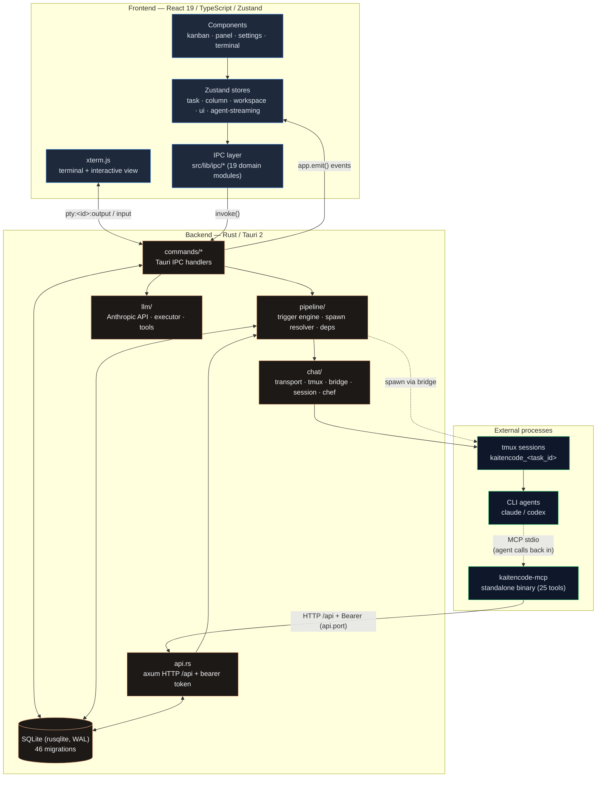
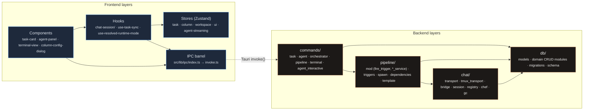
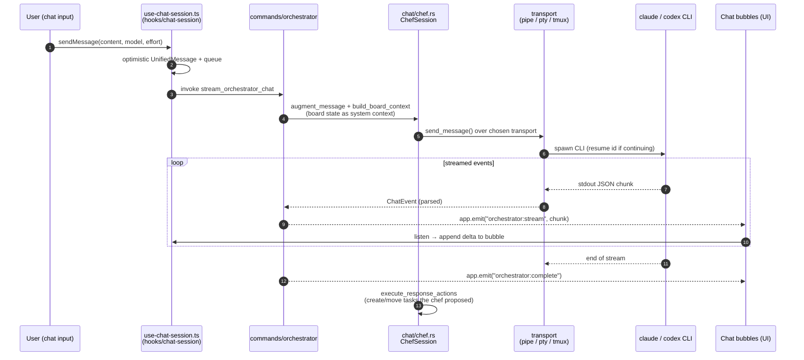
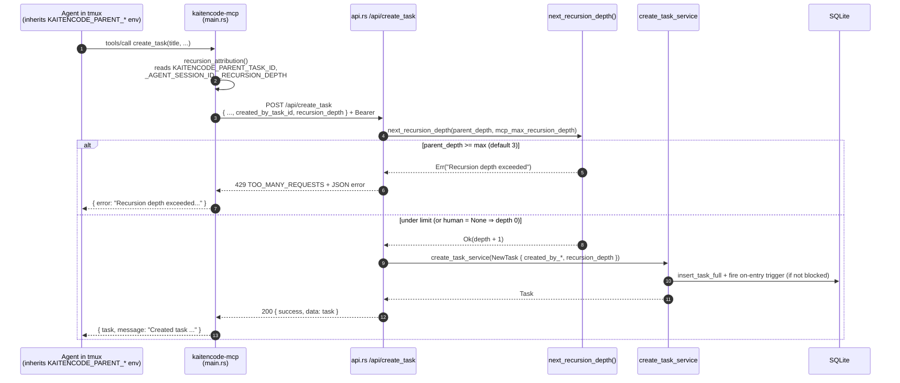
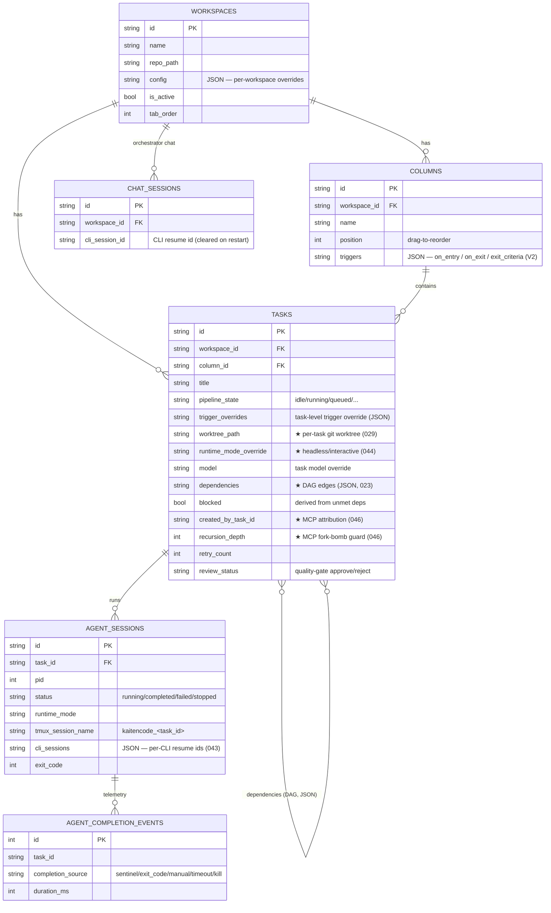

# KaitenCode — Architecture Showcase

## 1. What it is

KaitenCode is a **Tauri desktop app for orchestrating AI coding agents**. The kanban board isn't a passive label tracker — **columns are pipeline stages that *do things***: drop a task into a column and a trigger fires a real CLI agent (Claude Code, Codex) inside a per-task terminal session, watches it to completion, and auto-advances the card to the next stage. You talk (type or speak), an orchestrator decomposes work into tasks, and you watch agents build it.

**Why it's interesting (engineering-wise):** every agent — whether spawned by an automated column trigger or attached to interactively — runs in *one* transport: a per-task `tmux` session named `kaitencode_<task_id>`. Click a card mid-pipeline and you drop straight into the live agent's pane; there is no separate "output" view to reconcile. On top of that sits a from-the-ground-up **"source of truth" refactor**: a single pure resolver (`ResolvedAgentSpawn`) decides *which CLI, model, runtime mode, working dir, and prompt* a task should run with, and a small set of `*_service` functions funnel every create/move/update from the UI, the HTTP API, and the MCP server through identical code paths. The system also ships a **DAG task-dependency engine** with DFS cycle detection, **per-task git worktrees** for conflict-free parallel agents, and an **MCP server with a recursion guard** so an agent that spawns tasks can't fork-bomb the board.

---

## 2. System overview



**Channels at a glance:**

| Channel | Direction | Mechanism |
|---|---|---|
| `invoke()` | Frontend → Backend | Tauri IPC commands (`src/lib/ipc/` ↔ `src-tauri/src/commands/`) |
| Events | Backend → Frontend | `app.emit()` typed structs (`tasks:changed`, `pipeline:*`, `orchestrator:stream`, `pty:<id>:output`) |
| HTTP `/api` | MCP → App | axum server on a random port + per-process bearer token, discovered via `~/.kaitencode/api.port` |
| tmux | Backend ↔ Agent | `tmux new-session` / `send-keys -l` / `pipe-pane` / `wait-for` |

---

## 3. Layered component diagram



The backend's golden rule: **commands are thin.** They lock the DB, then call a `pipeline::*_service` (`create_task_service`, `move_task_service`, `update_task_service` in `src-tauri/src/pipeline/mod.rs`) so the Tauri command, the HTTP API (`src-tauri/src/api.rs`), and the chef all produce byte-identical behavior — same DB row, same trigger-firing rule, same `tasks:changed` event.

---

## 4. Signature flows (sequence diagrams)

### 4a. Trigger-driven agent spawn

Moving a task into a column whose `on_entry` is a `spawn_cli` action fires a real agent in a fresh tmux session and streams its output to the Terminal panel.

```mermaid
sequenceDiagram
    autonumber
    participant U as User (drag card)
    participant CMD as commands/task.rs
    participant SVC as move_task_service<br/>(pipeline/mod.rs)
    participant FT as fire_trigger → fire_on_entry<br/>(pipeline/triggers.rs)
    participant RES as spawn::resolve<br/>(pipeline/spawn.rs)
    participant BR as spawn_cli_trigger_task<br/>(chat/bridge.rs)
    participant TM as tmux session<br/>kaitencode_&lt;task_id&gt;
    participant FE as Terminal panel (xterm.js)

    U->>CMD: invoke move_task
    CMD->>SVC: move_task_service(id, target_col, pos)
    SVC->>SVC: cancel old agent if target has no spawn_cli<br/>fire_on_exit(old col) · cleanup worktree if terminal
    SVC->>FT: fire_trigger(task, target_col)
    Note over FT: concurrency gate —<br/>at workspace cap ⇒ mark task "queued"
    FT->>RES: resolve(task, col, ws, overrides, default_cli, default_model)
    RES-->>FT: ResolvedAgentSpawn { cli_type, model,<br/>runtime_mode, working_dir, initial_prompt }
    FT->>FT: create worktree · write .task.md ·<br/>set KAITENCODE_PARENT_* env
    FT->>BR: spawn_cli_trigger_task(resolved, env, ...)
    BR->>TM: tmux new-session -d (cwd = worktree)
    BR->>TM: pipe-pane -O → log file
    BR->>TM: send-keys -l "&lt;cmd&gt;; rc=$?; ...; tmux wait-for -S &lt;chan&gt;"
    BR->>TM: send-keys Enter
    TM-->>FE: pty:&lt;task_id&gt;:output (live stream via ManagedBridge)
    BR->>TM: tmux wait-for &lt;chan&gt; (blocks until done; 2h timeout)
    TM-->>BR: channel signaled + exit code from sentinel file
    BR->>SVC: mark_complete(task, success = exit==0)
    SVC->>FE: pipeline:complete · tasks:changed → auto-advance / promote queued
```

Key facts (verified): `spawn::resolve` is a **pure, `AppHandle`-free** function (`src-tauri/src/pipeline/spawn.rs`) implementing the precedence `trigger > task > column > workspace > global > default`; completion is detected by `tmux wait-for` against an exit-code sentinel file with a 2-hour hard timeout and a dead-agent watchdog (`src-tauri/src/chat/bridge.rs`); the workspace concurrency cap (default `DEFAULT_PIPELINE_MAX_CONCURRENT_AGENTS = 5`) marks over-limit tasks `queued`, which `promote_queued_tasks` drains FIFO on every completion.

### 4b. Unified chat streaming (orchestrator / chef)

The same `UnifiedChatSession` serves per-task agent chat and the workspace-level orchestrator. Here is the orchestrator/chef CLI streaming path.



Verified: the hook (`src/hooks/chat-session/use-chat-session.ts`) listens on `orchestrator:stream` and finalizes on `orchestrator:complete` (emitted from `src-tauri/src/commands/orchestrator/stream_cli.rs` / `stream.rs`); the chef builds board context and can execute board mutations after a response (`chat/chef.rs`). The transport is abstracted behind the `ChatTransport` trait (`chat/transport.rs`) with pipe/pty/tmux implementations.

### 4c. MCP `create_task` with the recursion guard

A trigger-spawned agent can call the MCP `create_task` tool to add sub-tasks. Source attribution and a depth limit prevent runaway self-spawning.



Verified: env vars are threaded by `execute_spawn_cli` / the bridge into the agent (`KAITENCODE_PARENT_TASK_ID` set in `pipeline/triggers.rs`; `KAITENCODE_PARENT_AGENT_SESSION_ID` added in `chat/bridge.rs`); the MCP reads them in `recursion_attribution()` (`mcp-server/src/main.rs`); the guard lives in `next_recursion_depth()` (`src-tauri/src/api.rs`) and reads `mcp_max_recursion_depth` (default `3`) from `AppSettings`. Human/UI creates pass `None` and are always roots at depth 0 — never refused. A non-2xx response is *not* collapsed into a transport error so the agent sees the real refusal message.

---

## 5. Data model

Derived from `src-tauri/src/db/models.rs`, `src-tauri/src/db/schema.rs`, and migrations (notably `029_task_worktree`, `044_runtime_mode_override`, `046_task_source_attribution`). Interesting columns are flagged.



> Task dependencies are stored as a JSON array on `tasks.dependencies` (each edge carries a `condition` like `completed` / `moved_to_column` / `agent_complete` and an `on_met` action), not as a separate join table — see `src-tauri/src/pipeline/dependencies.rs`.

---

## 6. Tech stack

| Layer | Stack |
|---|---|
| **Frontend** | React 19, TypeScript 5.7, Zustand 5, TailwindCSS 4, Motion (Framer), @dnd-kit (core/sortable), xterm.js + webgl/fit/search/unicode11 addons, Shiki, react-markdown |
| **Backend** | Rust 2021, Tauri 2, tokio (full), rusqlite (SQLite, WAL), axum 0.8 (HTTP API), git2 0.19, reqwest, pty-process, libc, chrono, serde |
| **Agent transport** | `tmux` (one session per task) + CLI agents (`claude`, `codex`) |
| **MCP server** | Standalone Rust binary (`mcp-server/`), JSON-RPC over stdio, 25 tools, `ureq` HTTP bridge to the app |
| **Voice (optional)** | whisper-rs + symphonia + cpal (feature-gated `voice`) |
| **Build** | Vite 6, pnpm 9, Cargo workspace (app + mcp-server share one rusqlite for WAL compatibility), Tauri bundler |
| **Testing** | Vitest + Testing Library (frontend), `cargo test` (backend, incl. pure-function unit tests for `spawn::resolve`, `decide_completion`, `next_recursion_depth`), Playwright (mock E2E), WebDriverIO + `tauri-driver` (real E2E) |

---

## 7. Technical highlights

- **One transport for everything.** Pipeline triggers and the interactive Terminal panel share a single per-task `tmux` session (`kaitencode_<task_id>`). Headless triggers inject a command via `send-keys -l`, mirror output with `pipe-pane`, and detect completion with `tmux wait-for` against an exit-code sentinel file; the Terminal panel just attaches to the same session. No separate output channel to keep in sync. (`src-tauri/src/chat/bridge.rs`, `chat/tmux_transport.rs`)

- **"Source of truth" spawn resolver.** `spawn::resolve()` is a pure, `AppHandle`-free, fully unit-tested function returning a `ResolvedAgentSpawn { cli_type, model, runtime_mode, working_dir, initial_prompt }`. Every spawn entry point (headless/managed/interactive triggers, per-task chat turn, restart) derives its parameters from this one place, implementing the documented precedence `trigger > task > column > workspace > global > default`. (`src-tauri/src/pipeline/spawn.rs`)

- **`*_service` funnels.** `create_task_service` / `move_task_service` / `update_task_service` are the single code paths every surface (Tauri command, HTTP `/api`, chef) calls — guaranteeing identical DB writes, dependency derivation, trigger firing, and `tasks:changed` emission regardless of who initiated the mutation. (`src-tauri/src/pipeline/mod.rs`)

- **Per-task git worktrees.** Tasks get isolated worktrees at `<repo>/.worktrees/kaitencode-<task_id>/` so parallel agents never fight over a branch; `.worktrees/` is auto-gitignored, and worktrees are cleaned up when a task reaches the terminal column. (`src-tauri/src/git/branch_manager.rs`, migration 029)

- **DAG dependency engine with cycle detection.** Adding a dependency runs DFS cycle detection (`validate_dependencies`); when a blocker satisfies a `condition` (`completed` / `moved_to_column` / `at_or_past_column` / `agent_complete`), `check_dependents` unblocks downstream tasks and fires their `on_met` action. (`src-tauri/src/pipeline/dependencies.rs`)

- **MCP recursion guard + source attribution.** Trigger-spawned agents inherit `KAITENCODE_PARENT_*` env vars; the MCP threads them into `/api/create_task`, where `next_recursion_depth()` records `created_by_task_id` / `recursion_depth` and refuses (HTTP 429) once a chain hits `mcp_max_recursion_depth` (default 3) — stopping an agent from fork-bombing the board. (`src-tauri/src/api.rs`, `mcp-server/src/main.rs`, migration 046)

- **Runtime-mode resolution hierarchy.** `resolve_runtime_mode_with_workspace_config` walks `trigger > task > column > workspace > global > default` to produce a `ResolvedRuntimeMode { mode, render, source }`, folding legacy `terminal`/`managed` tokens into `headless` and gating `interactive` behind a dev flag. The UI surfaces the resolved value *and its source* ("Effective: X from Y"). (`src-tauri/src/pipeline/triggers.rs`, `src/hooks/use-resolved-runtime-mode.ts`)

- **Unified chat transport abstraction.** A `ChatTransport` trait backs three implementations — `PipeTransport` (structured JSON → chat bubbles), `PtyTransport` (legacy raw), and `TmuxTransport` (persistent, resizable, survives app restarts) — under one `UnifiedChatSession` lifecycle with resume-id tracking. (`src-tauri/src/chat/transport.rs`, `session.rs`)

- **Resilient completion + auto-retry.** `decide_completion` is a pure decision function (auto-advance / retry / complete / fail) with unbounded "siege" retry capped by wall-clock time; `max_retries` drives per-task retry counts that reset on success; a post-merge verification gate refuses to mark a task Done if `origin/main` didn't actually advance. (`src-tauri/src/pipeline/mod.rs`)

- **Completion telemetry.** Every agent finish appends an `agent_completion_events` row tagging the signal (`sentinel` / `exit_code` / `manual` / `timeout` / `kill`) so the reliability of each completion path is measurable. (migration 045)

---

## 8. What I'd show in a demo

| Feature | Where to click |
|---|---|
| **Talk → tasks** | Type or speak into the orchestrator chat at the bottom — watch the chef decompose it into cards (`agent-panel` / chat input). |
| **Columns that *do things*** | Drag a card into a `spawn_cli` column → an agent launches in a tmux session and the card shows live status. |
| **Drop into the live agent** | Click a running card mid-pipeline → the Terminal panel attaches straight to its tmux pane (`terminal-view.tsx`). |
| **Configure a pipeline stage** | Right-click a column header → trigger + exit-criteria editor (`column-config-dialog.tsx`). |
| **Parallel agents, no conflicts** | Run several cards at once — each works in its own `.worktrees/kaitencode-<id>/` worktree (purple dot on cards). |
| **Task dependencies (DAG)** | Open a task's settings (`L` key) → wire dependencies; blocked cards show "Waiting for: …" with bezier lines on the board. |
| **Quality gate** | A `manual_approval` column shows Pending/Approved/Rejected badges; Approve/Reject drives the pipeline. |
| **Agent-managed board (MCP)** | Attach `kaitencode-mcp` to an external Claude Code session and have *it* create/move tasks — recursion guard keeps it safe. |
| **Pipeline templates** | Save a column layout as a template and apply it to a fresh workspace (`templates/`). |
| **Cost & timing** | Open a task's detail → usage section (tokens/cost/duration) and per-column timing analytics. |

---

*Evidence is cited inline with real file paths. Diagrams render natively on GitHub.*
