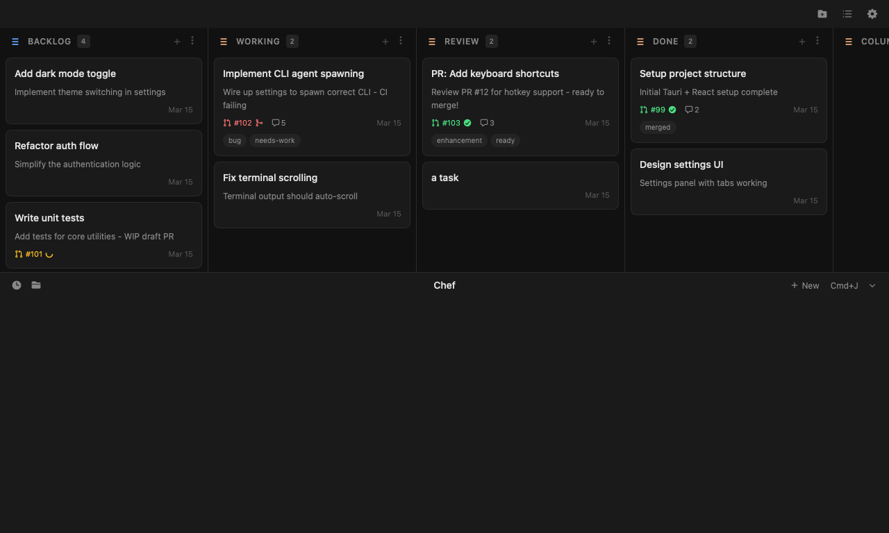
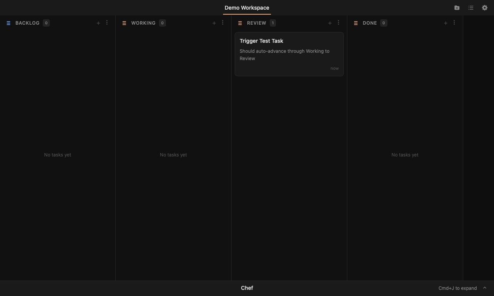

# Pipeline v2 User Guide

Pipeline v2 turns Bento-ya into a guided production line for AI coding tasks. Instead of dragging a card through a few broad states and remembering what to do next, each column has a specific job. Some columns run agents, some columns run local automation, and some columns wait for the rest of the batch before moving forward.



The full flow is:

```text
Backlog -> Setup -> Plan -> Implement -> Review -> Verify -> PR -> Staging -> Merge -> Done
```

## Column Flow

**Backlog** is the holding area. Put rough ideas, bugs, chores, and user requests here before they are ready to run. Nothing happens automatically while a task stays in Backlog.

**Setup** prepares the task for agent work. Bento-ya creates an isolated git branch and worktree, records the task's working directory, and immediately sends the task onward. This keeps concurrent tasks from editing the same checkout.

**Plan** asks an agent to inspect the task and repository, then write a `.task.md` plan. The Plan agent should not implement. Its job is to make the work explicit enough that the Implement stage can execute without guessing.

**Implement** asks an agent to read `.task.md`, make the code or documentation changes, run relevant checks, and commit its work.

**Review** runs one focused review pass. The review agent looks for logic bugs, quality issues, missed requirements, and test gaps. If it fixes anything, it commits those fixes before the task continues.

**Verify** runs the final mechanical checks. For normal source changes this means type-checks and unit tests. End-to-end tests are conditional: they run when route-level UI files changed, and are skipped for lower-risk library, component, documentation, or configuration-only changes.

**PR** pushes the task branch and opens a pull request against the batch staging branch. If type-checking fails here, the task is marked failed instead of creating a broken PR.

**Staging** waits until every task in the batch has reached the PR/Staging point. Then Bento-ya combines the branches into one staging branch and opens the staging-to-main PR.

**Merge** watches the staging PR. After CI passes, Bento-ya squash merges the staging branch, moves the batch's tasks to Done, cleans up worktrees and branches, and unblocks dependent tasks.

**Done** is the terminal state. The task has landed on main or was manually completed outside the automated flow.



## Batches

A batch is a group of tasks that should land together. Bento-ya assigns a `batch_id` when tasks enter the automated pipeline. Tasks queued together, or tasks that belong to the same dependency chain, usually share a batch.

For example, imagine three related tasks:

- Add a backend setting for model discovery.
- Expose the setting in the React preferences panel.
- Update the onboarding copy to mention the setting.

Each task can be planned, implemented, reviewed, and verified in its own worktree. That keeps agent work parallel and easier to inspect. The tasks do not merge directly into main one by one. Instead, they collect in Staging, where Bento-ya creates a single combined branch. CI then tests the integrated result, which is where cross-task conflicts and missed assumptions are most likely to appear.

A smaller batch might contain one task, such as "Fix typo in README." A larger batch might contain a full feature split across backend, frontend, tests, and docs. Prefer smaller batches when tasks are unrelated. Prefer one batch when tasks depend on each other or must ship as one coherent change.

## Queueing Tasks

Start by writing a task card in Backlog with enough context for planning: the user-visible goal, any known files or features involved, acceptance criteria, and checks that must pass. When the task is ready, move it into the automated flow. Bento-ya will run Setup, then Plan.

After Plan finishes, open the generated `.task.md` before letting the task continue. A good plan should list the intended changes, the likely files, test strategy, and any risks. If the plan is vague, edit the task or rerun planning before implementation. The quality of Implement depends heavily on the quality of Plan.

Dependencies matter. If Task B depends on Task A, record that relationship instead of relying on memory. When Task A reaches Done through Merge, Bento-ya can automatically unblock Task B and send it to Setup.

## Concurrency

Pipeline v2 is designed for multiple agents working at once. Setup gives each task a separate worktree and branch, so one task can modify `src-tauri/` while another modifies `src/` without sharing a dirty checkout. Agent columns can run independently as long as the tasks are not blocked by dependencies.

Concurrency is not the same as conflict-free work. Two tasks can still edit the same file or make incompatible assumptions. Staging is the integration point that catches this. If a combined branch fails to merge or fails type-checking, treat that as a batch issue: inspect the conflicting tasks together, resolve the integrated branch, and rerun verification.

Use concurrency most aggressively for independent work: documentation, isolated components, backend commands with separate ownership, or tests around distinct modules. Use it carefully for shared state, migrations, core data models, and broad refactors.

## Troubleshooting

If a task looks stuck in Setup, check whether the workspace path and branch were created. Setup is a no-agent column, so failures usually point to git, filesystem permissions, or an invalid repository path.

If a task is stuck in Plan, Implement, Review, or Verify, open its terminal/session panel and check whether the agent process is still running. If the process died, the pipeline should eventually mark the session completed or failed. You can rerun the column after confirming there is no useful uncommitted work to preserve.

If a task is stuck in PR, run the same checks locally that the PR column runs: type-check first, then confirm `gh` is installed and authenticated. PR creation depends on a clean branch and a reachable GitHub remote.

If Staging is waiting, look at the other tasks in the same batch. Staging intentionally holds until all batch members have reached the required point. A single failed or unfinished task can hold the whole batch.

If Merge is waiting, inspect the staging PR's CI. Merge is deliberately conservative: it should not land the combined branch until CI has passed.

If tasks conflict, resolve the conflict on the staging branch and rerun verification. Do not hide the conflict by merging one task early unless the batch no longer needs to land together.

## Tips For Good Plan Output

Ask for plans that are specific, testable, and bounded. A strong Plan prompt includes:

- The product behavior that should change.
- Files or areas that are likely involved, if known.
- What must not change.
- Required checks, such as `cargo check`, `cargo test`, `npx tsc --noEmit`, or `npx vitest run`.
- Acceptance criteria written from the user's point of view.

Avoid prompts like "make this better" or "fix the UI." Better prompts say what is wrong, where it appears, and how success should be verified. For example: "In the task detail panel, show dependency blockers above checklist items. Keep existing drag-and-drop behavior unchanged. Add or update tests for the dependency display."

The Plan stage should produce a handoff that another agent, or a human, can execute. If it does not, stop there and improve the plan before spending implementation time.
